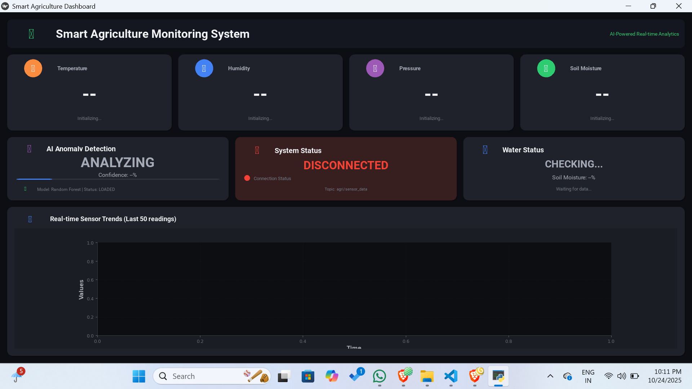
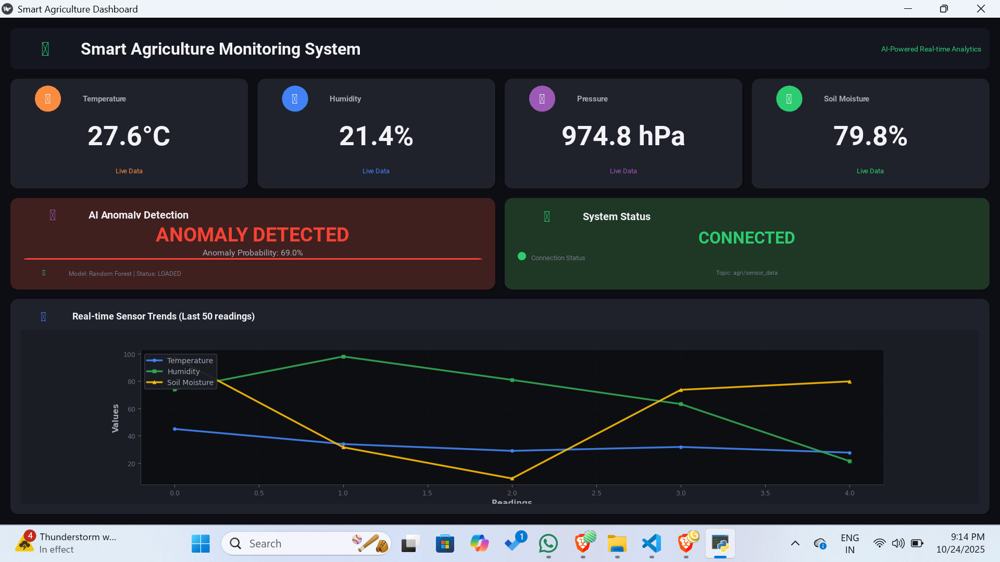
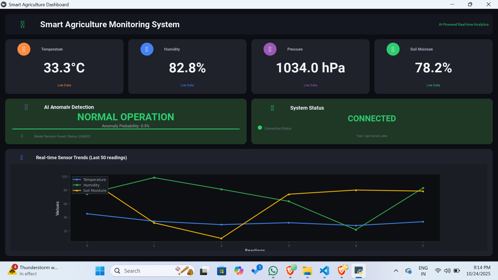

# 🌾 Smart Agriculture Monitoring System

A **real-time AI-powered dashboard** to monitor environmental and soil parameters for agriculture.
Detects anomalies using a pre-trained machine learning model and recommends irrigation based on soil moisture levels.

---

## 🚀 Features

* 🌡️ Real-time **Temperature, Humidity, Pressure, and Soil Moisture** monitoring
* 💧 **Water requirement alerts** for low soil moisture
* 🤖 **Anomaly detection** using a pre-trained Random Forest model
* 📊 Interactive **live charts** showing sensor trends
* 🔌 MQTT integration for live sensor data
* 🧪 **Dummy data publishing** via MQTT for testing without real sensors

---

## 📁 Dataset

The dataset `agri_water_dataset.csv` contains:

* Environmental sensor readings: temperature, humidity, pressure
* Soil moisture readings
* Anomaly labels for model training

Explore the dataset and train your own model using the provided **Colab file**:
[Agri Water Dataset & Model Training Colab](https://github.com/classytamil/Agri-monitor-dashboard/blob/main/agri_colab_model_code.py)

---

## 📡 MQTT Publisher

* Simulates live sensor data and sends to topic: `agri/sensor_data`
* Publishes **dummy sensor readings**: temperature, humidity, pressure, soil moisture

**Broker Details:**

```text
Broker: broker.hivemq.com
Topic: agri/sensor_data
QoS: 1
```

* Data can be published every 2 seconds for testing the dashboard.

---

## 🧠 Machine Learning Model

* Pre-trained **Random Forest model** (`agri_water_model.pkl`) for anomaly detection
* Predicts whether readings are **Normal** ✅ or **Anomalous** ⚠️
* Provides confidence score for predictions
* Updates the dashboard in real-time

---

## 🖥️ Dashboard

Built with **Kivy**, featuring:

* 📟 **Sensor Cards**: Temperature, Humidity, Pressure, Soil Moisture
* 💦 **Water Alert Card**: Shows if irrigation is needed
* ⚠️ **Anomaly Detection Card**: Shows predictions and confidence
* 📈 **Live Chart Card**: Trends of last 50 readings
* 🟢 **System Status Card**: MQTT connection status

---

## 🛠️ Installation

1. Clone the repository:

```bash
git clone https://github.com/classytamil/Agri-monitor-dashboard.git
cd Agri-monitor-dashboard
```


2. Install dependencies:

```bash
pip install -r req.txt
garden install matplotlib
```

3. Ensure these files exist in the project directory:

* `agri_water_model.pkl` – pre-trained Random Forest model
* `agri_water_dataset.csv` – dataset for exploration or retraining

---

## ▶️ Usage

1. **Start MQTT Publisher** to send dummy data:

```bash
python mqtt_publisher.py
```

2. **Run the Dashboard**:

```bash
python agri_dashboard.py
```

3. The dashboard displays:

* Live sensor readings 🌡️💧
* Anomaly detection results ⚠️
* Water alerts 💦
* Trend charts 📈
* MQTT connection status 🟢

---

## 🖼️ Screenshots


<p align="center">
  
</p>

<p align="center">
  
</p>


<p align="center">
  
</p>

---

## 📜 License

* MIT License – Open-source and free to use
